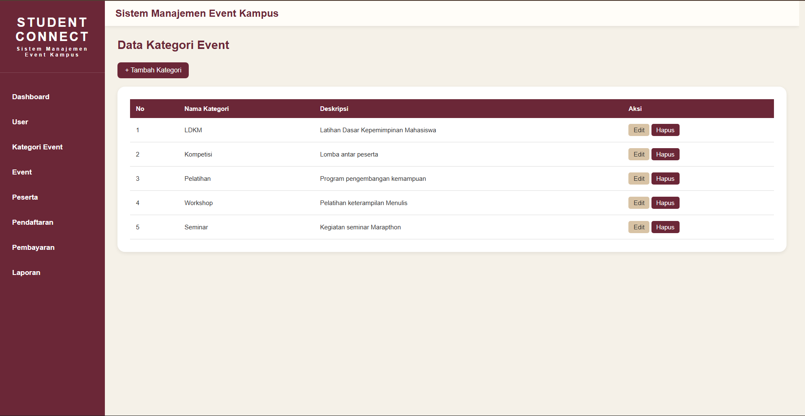
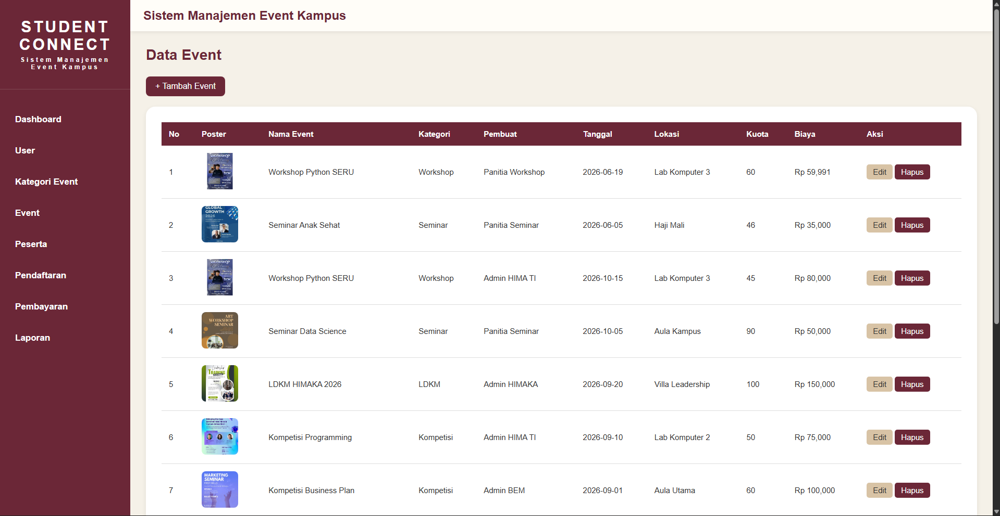
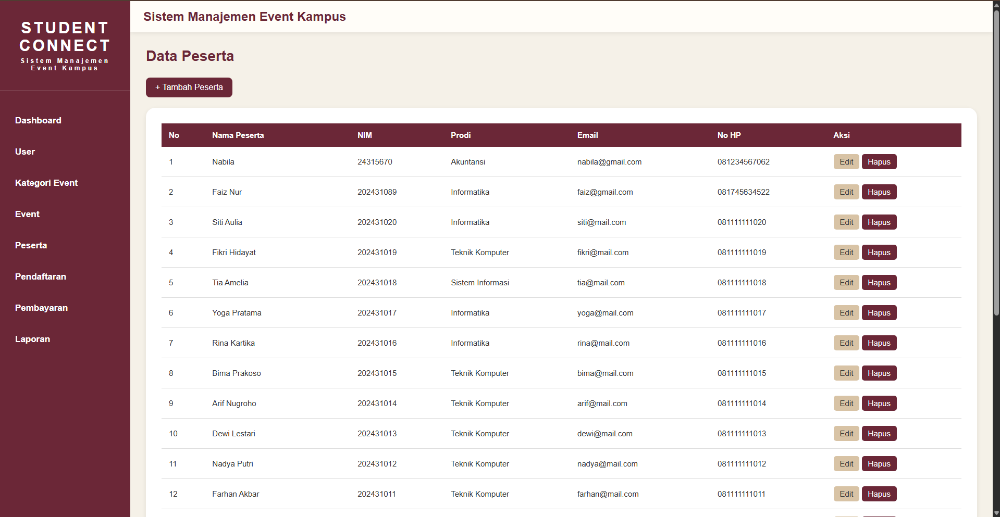
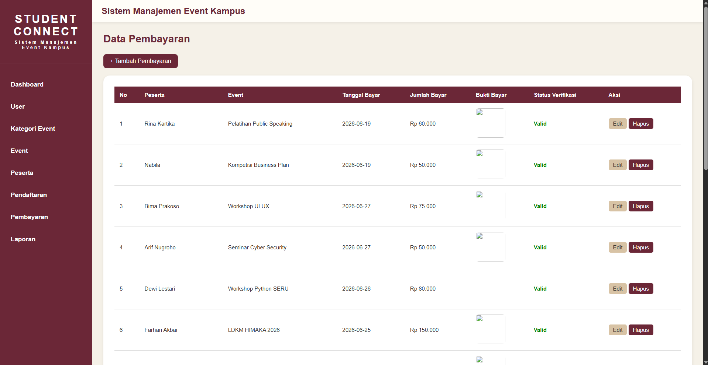

# Student Connect

Student Connect merupakan platform manajemen kegiatan mahasiswa yang dirancang untuk membantu pengelolaan event kampus secara terintegrasi. Sistem ini memfasilitasi pengelolaan event, data peserta, pendaftaran, pembayaran, hingga laporan dalam satu aplikasi yang mudah digunakan.

## Problem Solving

Aplikasi ini dikembangkan untuk membantu:

- Mengurangi pencatatan data secara manual.
- Mempermudah pengelolaan event dan peserta.
- Membantu proses pendaftaran kegiatan secara terstruktur.
- Memudahkan verifikasi pembayaran peserta.
- Menyediakan laporan dan statistik kegiatan secara cepat.
- Meningkatkan efisiensi administrasi organisasi dan kepanitiaan.

## Teknologi yang Digunakan

- PHP Native
- MySQL
- HTML5
- CSS3
- XAMPP

---

## Struktur Project

```plaintext
Student Connect/
│
├── assets/
│   └── style.css
│
├── config/
│   └── koneksi.php
│
├── layout/
│   ├── header.php
│   └── sidebar.php
│
├── user/
│   ├── index.php
│   ├── tambah.php
│   ├── edit.php
│   └── hapus.php
│
├── kategori/
│   ├── index.php
│   ├── tambah.php
│   ├── edit.php
│   └── hapus.php
│
├── event/
│   ├── index.php
│   ├── tambah.php
│   ├── edit.php
│   └── hapus.php
│
├── peserta/
│   ├── index.php
│   ├── tambah.php
│   ├── edit.php
│   └── hapus.php
│
├── pendaftaran/
│   ├── index.php
│   ├── tambah.php
│   ├── edit.php
│   └── hapus.php
│
├── pembayaran/
│   ├── index.php
│   ├── tambah.php
│   ├── edit.php
│   └── hapus.php
│
├── laporan/
│   └── index.php
│
├── database/
│   └── simeka.sql
│
├── index.php
│
└── README.md
```

---

## Cara Menjalankan Aplikasi Secara Lokal

### 1. Install XAMPP
install XAMPP terlebih dahulu dan memastikan service berikut aktif:
- Apache
- MySQL
---
### 2. Simpan Project
Pindahkan folder project ke dalam direktori:
```plaintext
C:\xampp\htdocs\
```
---
### 3. Membuat Database
Buka browser:
```plaintext
http://localhost/phpmyadmin
```

## 4. Import Database

Pilih database:

```plaintext
project_ir
```
Kemudian:
1. Klik menu **Import**
2. Klik **Choose File**
3. Pilih file:
```plaintext
database/simeka.sql
```
4. Klik **Go**
Tunggu hingga proses import selesai.
---

## 5. Konfigurasi Database

Buka file:
```plaintext
config/koneksi.php
```
Pastikan konfigurasi sesuai:
```php
<?php

$conn = mysqli_connect(
    "localhost",
    "root",
    "",
    "simeka"
);

?>
```
---

## 6. Menjalankan Aplikasi

Aktifkan:

- Apache
- MySQL

melalui XAMPP Control Panel.

Buka browser:

```plaintext
http://localhost/SIMEKA
```
atau sesuaikan dengan nama folder project.

Contoh:
```plaintext
http://localhost/PROJECT LAB IR (GOOD LUCK)
```

---

# Petunjuk Operasional Sistem

## 1. Dashboard
Dashboard merupakan halaman utama sistem.
Informasi yang ditampilkan:

- Total Event
- Total Peserta
- Total Pendaftaran
- Total Pembayaran Valid
- Event Terbaru

Tujuan:

Memberikan ringkasan kondisi sistem secara cepat kepada administrator.

---

## 2. Menu User
digunakan untuk mengelola data pengguna sistem. Admin dapat melakukan operasi CRUD (Create, Read, Update, Delete) terhadap data user yang terdaftar.

---

## 3. Menu Kategori Event

Digunakan untuk mengelompokkan event berdasarkan kategori tertentu seperti seminar, workshop, webinar, maupun kompetisi sehingga data kegiatan lebih terstruktur.

---

## 4. Menu Event

dapat mengelola seluruh data kegiatan kampus, meliputi nama event, kategori, tanggal pelaksanaan, lokasi, kuota peserta, dan biaya pendaftaran.

---

## 5. Menu Peserta

digunakan untuk mengelola data peserta yang mengikuti kegiatan kampus. Data peserta dapat ditambahkan, diperbarui, maupun dihapus sesuai kebutuhan

---

## 6. Menu Pendaftaran

Berfungsi untuk menghubungkan peserta dengan event yang dipilih. Setiap data pendaftaran akan tersimpan dan dapat dipantau melalui sistem.

---

## 7. Menu Pembayaran

Digunakan untuk mencatat transaksi pembayaran peserta serta melakukan verifikasi status pembayaran menjadi Valid atau Pending.

---

## 8. Menu Laporan

Menyajikan berbagai informasi statistik seperti total event, total peserta, total pendaftaran, total pendapatan, event terpopuler, pendapatan per event, dan statistik peserta berdasarkan program studi.

### Dashboard Laporan, Insight Event, Top 5 Event terpopuler
Menampilkan:

- Total Event
- Total Peserta
- Total Pendaftaran
- Total Pendapatan
- Event Terpopuler
- Event Termahal
- Pembayaran Valid
- Pembayaran Pending

### Statistik Program Studi
Menampilkan jumlah peserta berdasarkan program studi.

---

# Alur Penggunaan Sistem

```plaintext
Dashboard
    ↓
Kategori Event
    ↓
Event
    ↓
Peserta
    ↓
Pendaftaran
    ↓
Pembayaran
    ↓
Verifikasi Pembayaran
    ↓
Laporan
```

Urutan di atas merupakan alur penggunaan sistem yang direkomendasikan agar data saling terhubung dengan benar.

---

# Pengembang

SIMEKA dibuat sebagai implementasi Sistem Manajemen Event Kampus menggunakan PHP Native dan MySQL.
